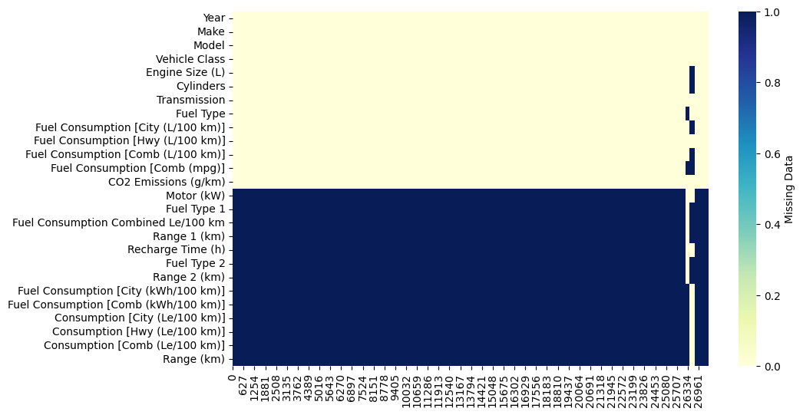

# CO2 Estimation of Cars using scikit-learn
CO2 Estimation of Cars with the help of **scikit-learn**

# Dataset
Please refer to the [dataset](https://open.canada.ca/data/en/dataset/98f1a129-f628-4ce4-b24d-6f16bf24dd64/resource/b6100f60-5e63-437d-b122-db76c467c0a7) for the topic. 

## For Data Cleaning and EDA
Please refer to the **CO2_Emmision_Playbook_1.ipynb** and **CO2_Emmision_Playbook_2.ipynb**
I have tried to cover most of the data cleaning and EDA for the provided dataset.

## Details about the Dataset

## First hand Analysis
1. The dataset comprises a total of 25 features.

2. Among these 25 features, the 12th feature corresponds to CO2 emissions, which serves as our target variable.

3. Additionally, it is evident that there are multiple missing features within the range spanning from **Motor (kW)** to **Range (km).**

4. Some features are categorical and some are numerical.
5. Dataset contains cars from different fuel option such as Petrol, Hybrid, EV.

### Missing Features

### Correlation Among the features

## Models Tried 
1. Dummy Regression
2. Linear Regression
3. Ridge Regression
4. Lasso Regression
5. Random Forest
6. Gradient Boosting
7. Light GBM
8. XGB Regressor
9. KNN Regressor
10. SVR Regressor
11. CatBoost Regressor
12. Decision Tree Regressor
13. MLP Regressor

##
**Grid Search** was used with these models to get best model possible.
**PipeLine** was used for the scaling and encoding of the numerical and categorical features
**Column Transformer** was used to combine the scaling and encoding of numerical and categorical features.
Refer to the **CO2_Estimation_04.ipynb** for:
1. Data Cleaning
2. Pipeline
3. Column Transformer
4. Grid Search
5. ML Flow
6. Training
7. Testing
8. Model Saving
9. Plotting

## The Best Model
**MLP Regressor** was the best model among all the other models. With little Grid Search, We were able to find the optimal solution, which leads to low training and testing error. 

## Model: MLP Regressor
#### Best Hyperparameters: {'model__activation': 'relu', 'model__alpha': 0.01, 'model__hidden_layer_sizes': (100, 200, 100), 'model__solver': 'lbfgs'}
#### Mean Squared Error on Test Set: 7.31
#### Root Mean Squared Error on Test Set: 2.70
#### R-squared: 1.00